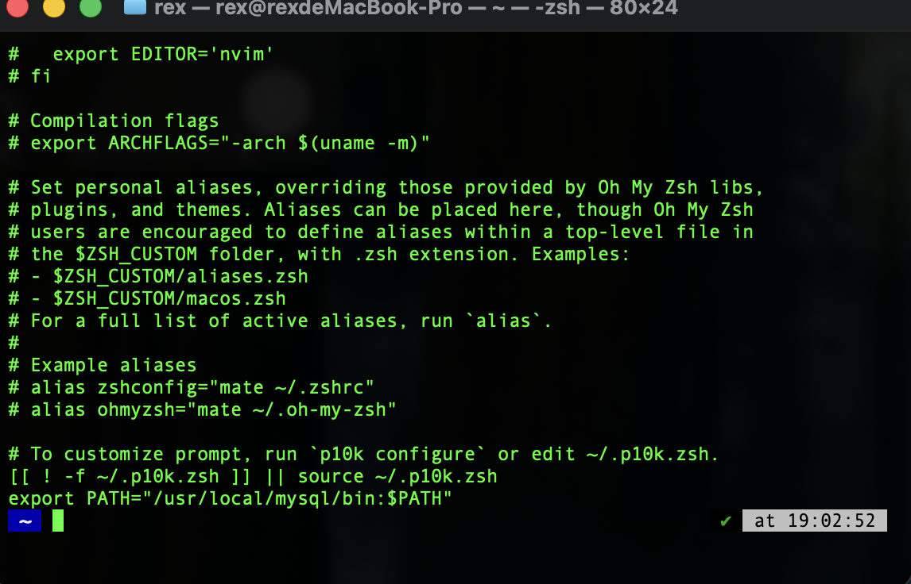
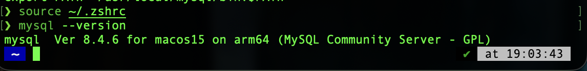

## 1.打开终端并检查环境变量是否可用
app中打开终端
```bash
#先输入
mysql --version        #如果输出版本号说明环境变量可用无需再添加，如果Command Not Found则需添加（接着往下看）
```

## 2.确认 MySQL 装在哪

在终端依次运行，哪个有输出就是哪个：

```bash
brew --prefix mysql  # Homebrew 装的
ls /usr/local/mysql/bin/mysql   # 官方安装包/dmg 装的
```


## 3.确定你使用的 Shell 终端
运行以下命令查看当前使用的 Shell：
```bash
echo $SHELL
```
如果输出是 /bin/zsh（macOS 默认），你需要修改 ~/.zshrc 文件。

如果输出是 /bin/bash，你需要修改 ~/.bash_profile 文件。

## 4.添加环境变量 (以zsh为例)

```bash
# 如果是用 Homebrew 安装：
echo 'export PATH="/opt/homebrew/opt/mysql/bin:$PATH"' >> ~/.zshrc

# 如果是用 官方 DMG 包安装：
echo 'export PATH="/usr/local/mysql/bin:$PATH"' >> ~/.zshrc

#检查~/.zshrc是否已经添加路径：
cat ~/.zshrc        #若有export PATH="/usr/local/mysql/bin:$PATH"则添加成功
```


## 5.检验

```bash
#输入：
source ~/.zshrc     #刷新
mysql --version     #显示版本号则成功
```

